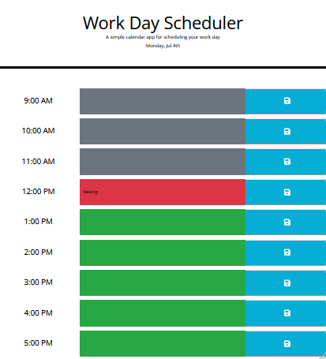

# Work-day-scheduler

## Summary
Daily event calendar created using Bootstap, JQuery, and moment.
The deployed application can be viewed [HERE]('https://rheangocle.github.io/Work-day-scheduler/').

## Criteria
When the planner is first opened, the current date is displayed at the top of the page. The planner will display time-blocks from 9AM to 5PM, the standard business hours. The user can click into each time block to edit and save their agenda for the day. Clicking the save button for each time block will save the event in the local storage that will remain on the page even if the user refreshes the page. In addition, the time blocks will be color coded to indicate the past (gray), present(red), or future (green).

## Web Application View
Beneath is a screenshot of the web application's appearance. 

